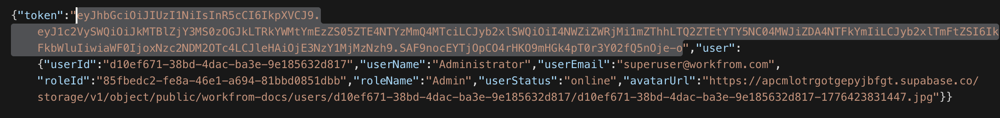
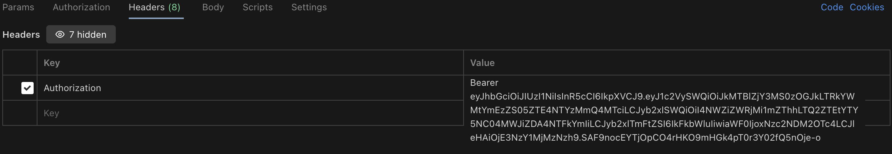

## API 

To test with Postman, follow these steps:
1. **LOGIN** : workfrom > auth > admin / user login
2. **GET TOKEN** : copy the access token from the response  

3. **SET TOKEN** : set the access token as a header in Postman
    - Key: Authorization
    - Value: Bearer <access_token>

4. **TEST ENDPOINTS** : feel free to test any endpoints you want

If you wish to GET specific role / user / department / etc,
1. Run GET all users / roles / departments
2. Copy the id from the response
3. append to the url and run the GET request

## Endpoints

### Authentication
Most endpoints require a JWT token in the Authorization header:
`Authorization: Bearer <your-token>`

### Auth
| Method | Endpoint | Description |
|--------|----------|-------------|
| POST | `/auth/login` | Login with email/password |
| POST | `/auth/google` | Login with Google |
| POST | `/auth/logout` | Logout |

### Users
| Method | Endpoint | Description | Access |
|--------|----------|-------------|--------|
| GET | `/users` | List all users | Any authenticated |
| GET | `/users/me` | Get own profile | Any authenticated |
| GET | `/users/:id` | Get user by ID | Any authenticated |
| POST | `/users` | Create user | Admin only |
| PUT | `/users/me` | Update own profile | Any authenticated |
| PUT | `/users/:id` | Update user | Admin only |
| DELETE | `/users/:id` | Delete user | Admin only |

### Roles
| Method | Endpoint | Description | Access |
|--------|----------|-------------|--------|
| GET | `/roles` | List all roles | Any authenticated |
| GET | `/roles/:id` | Get role by ID | Any authenticated |
| POST | `/roles` | Create role | Admin only |

### Departments
| Method | Endpoint | Description | Access |
|--------|----------|-------------|--------|
| GET | `/departments` | List departments | Any authenticated |
| GET | `/departments/:id` | Get department | Any authenticated |
| POST | `/departments` | Create department | Admin only |