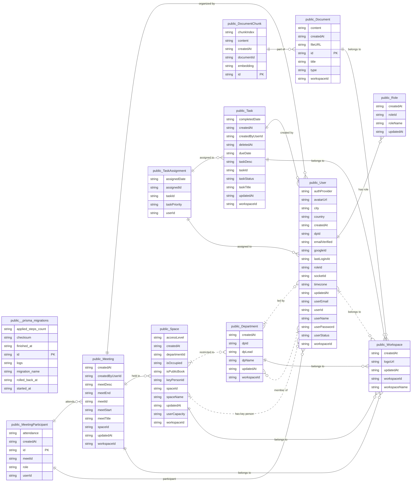

## Prisma ORM
#### Schema Changes
For development, we use `npx prisma db push` to update the database schema, this syncs your `schema.prisma` changes to Supabase in real time.

**Updates Do's and Dont's:**
- **DO** : Adding new tables / columns / fields (adding anything new)
- **DONT** : Renaming or deleting tables / columns / fields (renaming or deleting any existing attributes); this will cause data loss

<br>

**If you wish to rename or delete attributes:**
1. **Backup** : Backup the database
2. **Dashboard** : Go to Supabase dashboard (SQL Editor) and rename/delete the attributes
    ```sql
    -- Example: Rename a column
    ALTER TABLE "User" RENAME COLUMN "userName" TO "fullName";
    
    -- Example: Delete a column (⚠️ data loss!)
    ALTER TABLE "User" DROP COLUMN "testField";
    ```
3. **Update** : Edit the schema in `prisma/schema.prisma` to match the changes in dashboard
4. **Verify** : Run `npx prisma db push` (should say "Database already in sync")
5. **Generate** : Run `npx prisma generate` to update the prisma client 

<br>

**To update schema:**
1. **Edit** : Update the schema in `prisma/schema.prisma`
2. **Push** : Run `npx prisma db push` to update the schema in the database (supabase)
3. **Generate** : Run `npx prisma generate` to update the prisma client (so we can use the new attributes in backend)

> [!WARNING]
> Do not use `migrate dev` or `migrate reset` - prisma migrations conflicts with supabase's pre-installed extension (pgvector, etc).

<br>

**When someone updates the schema:**
1. **Pull** : Run `git pull` to get the latest `schema.prisma`
2. **Generate** : Run `npx prisma generate` to update prisma client (so typescript can read the new attributes)
3. [Optional] **Push** : Run `npx prisma db push` to verify sync

<br>

## Database Schema

Database Type: Cloud PostgreSQL (Supabase)  
ORM: Prisma (v6.19.3)  
Hosting: Supabase (AWS ap-southeast-1)  
Connection: Pooled via Supavisor (DATABASE_URL) + Direct (DIRECT_URL)



> [!NOTE]
> #### ERD Notation Legend
> - **PK / FK**: Primary Key / Foreign Key
> - `||--o{` : **Required One-to-Many** (One parent *must* exist for many children)
> - `}|..o{` : **Optional Many-to-Many / Optional Relationship** (Zero or more can exist)

---

## Table Definitions

### 1. User & Access Control
| Table | Purpose | Key Fields |
| :--- | :--- | :--- |
| **User** | User accounts and profiles | `userId`, `userEmail`, `userName`, `userPassword`, `userStatus` (offline/online/focus/in_meeting/away), `roleId`, `workspaceId`, `dpId`, `avatarUrl`, `city`, `country`, `timezone`, `authProvider` (email/google), `googleId`, `emailVerified`, `lastLoginAt`, `socketId` |
| **Role** | User roles for RBAC | `roleId`, `roleName` |
| **Workspace** | Multi-tenant boundaries | `workspaceId`, `workspaceName`, `logoUrl` |
| **Department** | Organizational units | `dpId`, `dpName`, `dpLead` (references User), `workspaceId` |

### 2. Collaboration & Workflow
| Table | Purpose | Key Fields |
| :--- | :--- | :--- |
| **Space** | Virtual collaboration rooms | `spaceId`, `spaceName`, `accessLevel` (shared/department), `workspaceId`, `departmentId` (optional), `keyPersonId` (references User), `isPublicBook`, `userCapacity`, `isOccupied` |
| **Task** | Task management | `taskId`, `taskTitle`, `taskDesc`, `taskStatus` (not_started/in_progress/done), `workspaceId`, `createdByUserId`, `dueDate`, `completedDate` (auto-set when status=done), `deletedAt` (soft delete) |
| **TaskAssignment** | Junction table for task assignments | `assignedId`, `taskId`, `userId`, `taskPriority` (low/medium/high), `assignedDate` |
| **Meeting** | Events and scheduling | `meetId`, `workspaceId`, `spaceId`, `createdByUserId`, `meetTitle`, `meetDesc`, `meetStart`, `meetEnd` |
| **MeetingParticipant** | Junction table for meeting attendees | `id`, `meetId`, `userId`, `role` (organiser/participant), `attendance` (absent/present) |

### 3. Knowledge Base & RAG
| Table | Purpose | Key Fields |
| :--- | :--- | :--- |
| **Document** | Knowledge base storage | `id`, `title`, `fileURL` (PDF storage), `content` (extracted text for RAG/search), `type` (faq/meeting_summary), `workspaceId` |
| **DocumentChunk** | Vector chunks for AI search | `id`, `content`, `embedding` (Vector 1536), `chunkIndex`, `documentId` |

### 4. Real-time & Presence
| Table | Purpose | Key Fields |
| :--- | :--- | :--- |
| **User** (presence fields) | Real-time user presence | `socketId` (WebSocket connection ID), `userStatus` (offline/online/focus/in_meeting/away), `lastLoginAt` |

---

## Key Relationships

### Membership & Hierarchy
- **User ↔ Role:** Many-to-One. Each user is assigned a specific role.
- **User ↔ Workspace:** Many-to-One. Users belong to a workspace (tenant boundary).
- **Workspace ↔ Department:** One-to-Many. Workspaces are subdivided into departments.
- **Department ↔ Space:** One-to-Many. Spaces can be restricted to specific departments.
- **User ↔ Department:** Many-to-One. Users belong to a department (optional).
- **User ↔ Department (Lead):** One-to-One (unique). A user can lead only one department.

### Activity & Ownership
- **User ↔ Task/Meeting:** One-to-Many. Tracks the creator/owner of the resource.
- **Task ↔ User (via Assignment):** Many-to-Many. Handled via `TaskAssignment`.
- **Meeting ↔ User (via Participant):** Many-to-Many. Handled via `MeetingParticipant`.
- **Document ↔ Chunk:** One-to-Many. Documents are split into multiple vector embeddings for RAG.
- **Space ↔ User (Key Person):** One-to-One (unique). A user can be the key person for only one space.

---

## Constraints & Indexes

| Table | Constraint | Purpose |
| :--- | :--- | :--- |
| **User** | `UNIQUE(userEmail)` | Prevents duplicate accounts. |
| **User** | `UNIQUE(googleId)` | Ensures unique OAuth mapping. |
| **Department** | `UNIQUE(dpLead)` | Limits a user to leading only one department. |
| **Space** | `UNIQUE(keyPersonId)` | Limits a user to being the key person for one space. |
| **Space** | `UNIQUE(workspaceId, spaceName)` | Ensures unique space names within a workspace. |
| **TaskAssignment** | `UNIQUE(taskId, userId)` | Prevents duplicate user assignments per task. |
| **MeetingParticipant** | `UNIQUE(meetId, userId)` | Prevents duplicate attendance entries. |
| **DocumentChunk** | `UNIQUE(documentId, chunkIndex)` | Ensures chunk ordering and data integrity. |

| Table | Index | Purpose |
| :--- | :--- | :--- |
| **User** | `INDEX(lastLoginAt)` | For analytics and activity tracking. |
| **Task** | `INDEX(workspaceId, taskStatus)` | For filtered task lists. |
| **Task** | `INDEX(workspaceId, createdByUserId)` | For user-specific task queries. |
| **Task** | `INDEX(createdByUserId)` | For tasks created by a user. |
| **Task** | `INDEX(deletedAt)` | For soft delete queries. |
| **TaskAssignment** | `INDEX(userId)` | For user assignment lookups. |
| **TaskAssignment** | `INDEX(taskId)` | For task assignment lookups. |
| **TaskAssignment** | `INDEX(taskPriority)` | For filtering by priority. |
| **Meeting** | `INDEX(workspaceId)` | For workspace meeting queries. |
| **Meeting** | `INDEX(spaceId)` | For space meeting queries. |
| **Meeting** | `INDEX(workspaceId, meetStart)` | For calendar queries and scheduling. |
| **MeetingParticipant** | `INDEX(meetId, role)` | For role-based meeting participant queries. |
| **MeetingParticipant** | `INDEX(meetId)` | For meeting participant lookups. |
| **MeetingParticipant** | `INDEX(userId)` | For user's meeting participation. |
| **Document** | `INDEX(workspaceId)` | For workspace document queries. |
| **DocumentChunk** | `INDEX(documentId)` | For document chunk retrieval. |

---

## Enums & Constants

- **UserStatus:** `offline`, `online`, `focus`, `in_meeting`, `away`
- **AccessLevel:** `shared`, `department`
- **AttendanceStatus:** `absent`, `present`
- **TaskStatus:** `not_started`, `in_progress`, `done`
- **TaskPriority:** `low`, `medium`, `high`
- **MeetingRole:** `organiser`, `participant`
- **DocumentType:** `faq`, `meeting_summary`

---

## Permission Model

The system utilizes a multi-layered permission strategy:

1. **Global RBAC:** Managed via the `Role` table for broad application access.
2. **Departmental Isolation:** Users are tied to a `dpId`, restricting their visibility to specific internal units.
3. **Space-Level Security:** 
   - `shared`: Visible workspace-wide.
   - `department`: Restricted to members of the associated department.
4. **Ownership Rights:** 
   - `createdByUserId`: Grants administrative privileges over specific Tasks and Meetings.
   - `keyPersonId`: Grants administrative privileges over specific Spaces.
5. **Soft Delete:** Tasks support soft deletion via `deletedAt` field, allowing data recovery and auditing.

## Real-time Features

- **Presence Tracking:** `socketId` and `userStatus` fields enable real-time user presence detection.
- **Last Login Tracking:** `lastLoginAt` field for user activity analytics and session management.

<br>

*Last updated : July 2nd, 2026*
