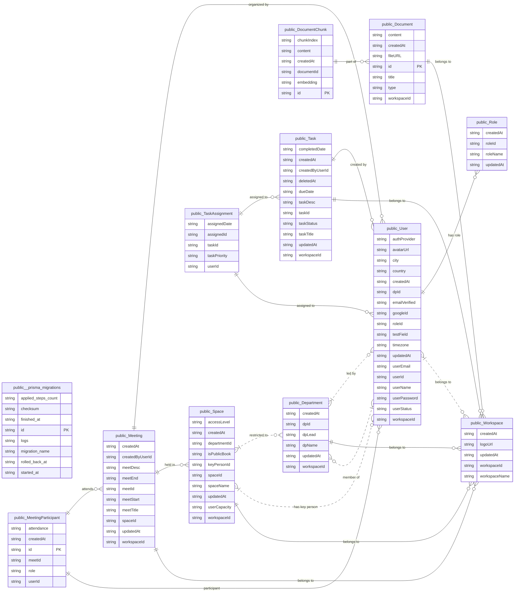

## Prisma ORM
#### Schema Changes
For development, we use `npx prisma db push` to update the database schema, this syncs your `schema.prisma` changes to Supabase in real time.

**Updates Do's and Dont's:**
- **DO** : Adding new tables / columns / fields (adding anything new)
- **DONT** : Renaming or deleting tables / columns / fields (renaming or deleting any existing attributes); this will cause data loss

<br>

**If you wish to rename or delete attributes:**
1. **Backup** : Backup the database
2. **Dashboard** : Go to Supabase dashboard (SQL Editor) and rename/delete the attributes
    ```sql
    -- Example: Rename a column
    ALTER TABLE "User" RENAME COLUMN "userName" TO "fullName";
    
    -- Example: Delete a column (⚠️ data loss!)
    ALTER TABLE "User" DROP COLUMN "testField";
    ```
3. **Update** : Edit the schema in `prisma/schema.prisma` to match the changes in dashboard
4. **Verify** : Run `npx prisma db push` (should say "Database already in sync")
5. **Generate** : Run `npx prisma generate` to update the prisma client 

<br>

**To update schema:**
1. **Edit** : Update the schema in `prisma/schema.prisma`
2. **Push** : Run `npx prisma db push` to update the schema in the database (supabase)
3. **Generate** : Run `npx prisma generate` to update the prisma client (so we can use the new attributes in backend)

> [!WARNING]
> Do not use `migrate dev` or `migrate reset` - prisma migrations conflicts with supabase's pre-installed extension (pgvector, etc).

<br>

**When someone updates the schema:**
1. **Pull** : Run `git pull` to get the latest `schema.prisma`
2. **Generate** : Run `npx prisma generate` to update prisma client (so typescript can read the new attributes)
3. [Optional] **Push** : Run `npx prisma db push` to verify sync

<br>

## Database Schema

Database Type: Cloud PostgreSQL (Supabase)  
ORM: Prisma (v6.19.3)  
Hosting: Supabase (AWS ap-southeast-1)  
Connection: Pooled via Supavisor (DATABASE_URL) + Direct (DIRECT_URL)



---

## Table Definitions

### 1. User & Access Control
| Table | Purpose | Key Fields |
| :--- | :--- | :--- |
| **User** | User accounts and profiles | `userId`, `userEmail`, `userName`, `userStatus`, `roleId`, `workspaceId`, `dpId`, `avatarUrl`, `timezone`, `authProvider` |
| **Role** | User roles for RBAC | `roleId`, `roleName` |
| **Workspace** | Multi-tenant boundaries | `workspaceId`, `workspaceName`, `logoUrl` |
| **Department** | Organizational units | `dpId`, `dpName`, `dpLead`, `workspaceId` |

### 2. Collaboration & Workflow
| Table | Purpose | Key Fields |
| :--- | :--- | :--- |
| **Space** | Virtual collaboration rooms | `spaceId`, `spaceName`, `accessLevel`, `departmentId`, `keyPersonId`, `isPublicBook`, `userCapacity` |
| **Task** | Task management | `taskId`, `taskTitle`, `taskDesc`, `taskStatus`, `workspaceId`, `createdByUserId` |
| **TaskAssignment** | Junction table for assignments | `assignedId`, `taskId`, `userId`, `taskPriority`, `assignedDate` |
| **Meeting** | Events and scheduling | `meetId`, `workspaceId`, `spaceId`, `createdByUserId`, `meetTitle`, `meetStart`, `meetEnd` |
| **MeetingParticipant** | Junction table for attendees | `id`, `meetId`, `userId`, `role`, `attendanceStatus` |

### 3. Knowledge Base & RAG
| Table | Purpose | Key Fields |
| :--- | :--- | :--- |
| **Document** | Knowledge base storage | `id`, `title`, `fileURL`, `type` (faq/meeting_summary), `workspaceId` |
| **DocumentChunk** | Vector chunks for AI search | `id`, `content`, `embedding` (Vector 1536), `chunkIndex`, `documentId` |

---

## Key Relationships

### Membership & Hierarchy
- **User ↔ Role:** Many-to-One. Each user is assigned a specific role.
- **User ↔ Workspace:** Many-to-One. Users belong to a workspace (tenant boundary).
- **Workspace ↔ Department:** One-to-Many. Workspaces are subdivided into departments.
- **Department ↔ Space:** One-to-Many. Spaces can be restricted to specific departments.

### Activity & Ownership
- **User ↔ Task/Meeting:** One-to-Many. Tracks the creator/owner of the resource.
- **Task ↔ User (via Assignment):** Many-to-Many. Handled via `TaskAssignment`.
- **Meeting ↔ User (via Participant):** Many-to-Many. Handled via `MeetingParticipant`.
- **Document ↔ Chunk:** One-to-Many. Documents are split into multiple vector embeddings for RAG.

---

## Constraints & Indexes

| Table | Constraint | Purpose |
| :--- | :--- | :--- |
| **User** | `UNIQUE(userEmail)` | Prevents duplicate accounts. |
| **User** | `UNIQUE(googleId)` | Ensures unique OAuth mapping. |
| **Department** | `UNIQUE(dpLead)` | Limits a user to leading only one department. |
| **Space** | `UNIQUE(keyPersonId)` | Limits a user to being the key person for one space. |
| **TaskAssignment** | `UNIQUE(taskId, userId)` | Prevents duplicate user assignments per task. |
| **MeetingParticipant** | `UNIQUE(meetId, userId)` | Prevents duplicate attendance entries. |
| **DocumentChunk** | `UNIQUE(documentId, chunkIndex)` | Ensures chunk ordering and data integrity. |

---

## Enums & Constants

- **UserStatus:** `offline`, `online`, `busy`, `in_meeting`
- **AccessLevel:** `shared`, `department`
- **TaskStatus:** `not_started`, `in_progress`, `done`
- **TaskPriority:** `low`, `medium`, `high`
- **MeetingRole:** `organiser`, `participant`
- **AttendanceStatus:** `absent`, `present`
- **DocumentType:** `faq`, `meeting_summary`

---

## Permission Model

The system utilizes a multi-layered permission strategy:

1.  **Global RBAC:** Managed via the `Role` table for broad application access.
2.  **Departmental Isolation:** Users are tied to a `dpId`, restricting their visibility to specific internal units.
3.  **Space-Level Security:** 
    - `shared`: Visible workspace-wide.
    - `department`: Restricted to members of the associated department.
4.  **Ownership Rights:** The `createdByUserId` and `keyPersonId` fields grant administrative privileges over specific Tasks, Meetings, or Spaces.

<br>

*Last updated : April 17, 2026*
