## Prisma ORM
#### Schema Changes
For development, we use `npx prisma db push` to update the database schema, this syncs your `schema.prisma` changes to Supabase in real time.

**Updates Do's and Dont's:**
- **DO** : Adding new tables / columns / fields (adding anything new)
- **DONT** : Renaming or deleting tables / columns / fields (renaming or deleting any existing attributes); this will cause data loss

<br>

**If you wish to rename or delete attributes:**
1. **Backup** : Backup the database
2. **Dashboard** : Go to Supabase dashboard (SQL Editor) and rename/delete the attributes
    ```sql
    -- Example: Rename a column
    ALTER TABLE "User" RENAME COLUMN "userName" TO "fullName";
    
    -- Example: Delete a column (⚠️ data loss!)
    ALTER TABLE "User" DROP COLUMN "testField";
    ```
3. **Update** : Edit the schema in `prisma/schema.prisma` to match the changes in dashboard
4. **Verify** : Run `npx prisma db push` (should say "Database already in sync")
5. **Generate** : Run `npx prisma generate` to update the prisma client 

<br>

**To update schema:**
1. **Edit** : Update the schema in `prisma/schema.prisma`
2. **Push** : Run `npx prisma db push` to update the schema in the database (supabase)
3. **Generate** : Run `npx prisma generate` to update the prisma client (so we can use the new attributes in backend)

> [!WARNING]
> Do not use `migrate dev` or `migrate reset` - prisma migrations conflicts with supabase's pre-installed extension (pgvector, etc).

<br>

**When someone updates the schema:**
1. **Pull** : Run `git pull` to get the latest `schema.prisma`
2. **Generate** : Run `npx prisma generate` to update prisma client (so typescript can read the new attributes)
3. [Optional] **Push** : Run `npx prisma db push` to verify sync

<br>

## Database Schema

Database Type: Cloud PostgreSQL (Supabase)  
ORM: Prisma (v6.19.3)  
Hosting: Supabase (AWS ap-southeast-1)  
Connection: Pooled via Supavisor (`DATABASE_URL`) + Direct (`DIRECT_URL`)

```mermaid
erDiagram
    direction LR

    Role {
        string roleId PK
        string roleName
        datetime createdAt
        datetime updatedAt
    }

    Department {
        string dpId PK
        string dpName
        string dpLead FK
        string workspaceId FK
        datetime createdAt
        datetime updatedAt
    }

    User {
        string userId PK
        string userEmail
        string userPassword
        string userName
        string userTitle
        string userStatus
        string roleId FK
        string workspaceId FK
        string dpId FK
        string avatarUrl
        datetime avatarSyncedAt
        string city
        string country
        string timezone
        string authProvider
        string googleId
        string socketId
        datetime lastLoginAt
        datetime dataExportRequestedAt
        datetime dataExportCompletedAt
        datetime deletionRequestedAt
        datetime deletedAt
        datetime createdAt
        datetime updatedAt
    }

    Workspace {
        string workspaceId PK
        string workspaceName
        datetime createdAt
        datetime updatedAt
    }

    Space {
        string spaceId PK
        string spaceName
        string workspaceId FK
        string accessLevel
        string departmentId FK
        int userCapacity
        datetime createdAt
        datetime updatedAt
    }

    Task {
        string taskId PK
        string taskTitle
        string taskDesc
        string taskStatus
        datetime dueDate
        datetime completedDate
        string workspaceId FK
        string createdByUserId FK
        datetime createdAt
        datetime updatedAt
        datetime deletedAt
    }

    TaskAssignment {
        string assignedId PK
        string taskId FK
        string userId FK
        string taskPriority
        datetime assignedDate
    }

    Meeting {
        string meetId PK
        string workspaceId FK
        string spaceId FK
        string createdByUserId FK
        string meetTitle
        string meetDesc
        datetime meetStart
        datetime meetEnd
        string status
        datetime createdAt
        datetime updatedAt
    }

    MeetingParticipant {
        string id PK
        string meetId FK
        string userId FK
        string role
        string attendance
        datetime createdAt
    }

    MeetingPin {
        string pinId PK
        string userId FK
        string meetId FK
        datetime createdAt
    }

    Conversation {
        string conversationId PK
        string workspaceId FK
        string type
        string groupName
        string avatarUrl
        string directKey
        string createdByUserId FK
        datetime createdAt
        datetime updatedAt
        datetime deletedAt
    }

    ConversationParticipant {
        string id PK
        string conversationId FK
        string userId FK
        datetime joinedAt
        datetime removedAt
        datetime lastReadAt
    }

    Message {
        string messageId PK
        string conversationId FK
        string authorId FK
        string text
        string callNote
        string linkUrl
        datetime createdAt
        datetime updatedAt
        datetime deletedAt
    }

    MessageAttachment {
        string id PK
        string messageId FK
        string name
        string kind
        string url
        string path
        string mimeType
        int sizeInBytes
        datetime createdAt
    }

    ConversationPin {
        string pinId PK
        string userId FK
        string conversationId FK
        datetime createdAt
    }

    Activity {
        string activityId PK
        string workspaceId FK
        string userId FK
        string type
        string action
        string contextTitle
        string contextDetails
        datetime createdAt
    }

    Recording {
        string recordingId PK
        string meetId FK
        string egressId
        string filename
        string status
        string fileUrl
        string summaryStatus
        string summary
        datetime createdAt
        datetime updatedAt
    }

    MeetingChatMessage {
        string id PK
        string meetId FK
        string senderId
        string senderName
        string message
        datetime createdAt
    }

    Workspace ||--o{ Department : "contains"
    Workspace ||--o{ User : "contains"
    Workspace ||--o{ Space : "contains"
    Workspace ||--o{ Task : "contains"
    Workspace ||--o{ Meeting : "contains"
    Workspace ||--o{ Conversation : "contains"
    Workspace ||--o{ Activity : "contains"

    Role ||--o{ User : "assigned to"
    Department |o--o| User : "led by"
    Department ||--o{ User : "members"
    Department ||--o{ Space : "restricts"

    User ||--o{ Task : "creates"
    User ||--o{ TaskAssignment : "assigned to"
    Task ||--o{ TaskAssignment : "has"

    Space ||--o{ Meeting : "hosts"
    User ||--o{ Meeting : "creates"
    Meeting ||--o{ MeetingParticipant : "has"
    User ||--o{ MeetingParticipant : "attends"
    Meeting ||--o{ MeetingPin : "pinned in"
    User ||--o{ MeetingPin : "pins"
    Meeting ||--o{ Recording : "recordings"
    Meeting ||--o{ MeetingChatMessage : "in-meeting messages"

    User ||--o{ Conversation : "creates"
    Conversation ||--o{ ConversationParticipant : "has"
    User ||--o{ ConversationParticipant : "participates"
    Conversation ||--o{ ConversationPin : "pinned in"
    User ||--o{ ConversationPin : "pins"
    Conversation ||--o{ Message : "contains"
    User ||--o{ Message : "sends"
    Message ||--o{ MessageAttachment : "has"

    User ||--o{ Activity : "performs"
```



> [!NOTE]
> #### ERD Notation Legend
> - **PK / FK**: Primary Key / Foreign Key
> - `||--o{` : **Required One-to-Many** (One parent *must* exist for zero or more children)
> - `|o--o|` : **Optional One-to-One** (Zero or one relationship)
> - `}|..o{` : **Optional Many-to-Many**

---

## Table Definitions

### 1. User & Access Control
| Table | Purpose | Key Fields |
| :--- | :--- | :--- |
| **User** | User accounts, profiles, real-time presence & GDPR deletion | `userId`, `userEmail`, `userPassword`, `userName`, `userTitle`, `userStatus` (offline/online/focus/in_meeting/away), `roleId`, `workspaceId`, `dpId`, `avatarUrl`, `avatarSyncedAt`, `city`, `country`, `timezone`, `authProvider` (email/google), `googleId`, `socketId`, `lastLoginAt`, `dataExportRequestedAt`, `dataExportCompletedAt`, `deletionRequestedAt`, `deletedAt` |
| **Role** | User roles for RBAC | `roleId`, `roleName` |
| **Workspace** | Multi-tenant boundaries | `workspaceId`, `workspaceName` |
| **Department** | Organizational units and department head assignments | `dpId`, `dpName`, `dpLead` (references User), `workspaceId` |

### 2. Spaces & Tasks
| Table | Purpose | Key Fields |
| :--- | :--- | :--- |
| **Space** | Virtual collaboration rooms with access level restrictions | `spaceId`, `spaceName`, `workspaceId`, `accessLevel` (shared/department/virtual), `departmentId` (optional), `userCapacity` |
| **Task** | Workspace task management with soft delete | `taskId`, `taskTitle`, `taskDesc`, `taskStatus` (not_started/in_progress/done), `dueDate`, `completedDate`, `workspaceId`, `createdByUserId`, `deletedAt` |
| **TaskAssignment** | Junction table for task assignments and priorities | `assignedId`, `taskId`, `userId`, `taskPriority` (low/medium/high), `assignedDate` |

### 3. Meetings & Recordings
| Table | Purpose | Key Fields |
| :--- | :--- | :--- |
| **Meeting** | Event scheduling, virtual room association & statuses | `meetId`, `workspaceId`, `spaceId`, `createdByUserId`, `meetTitle`, `meetDesc`, `meetStart`, `meetEnd`, `status` (scheduled/started) |
| **MeetingParticipant** | Junction table for meeting attendees, roles & attendance tracking | `id`, `meetId`, `userId`, `role` (organiser/participant), `attendance` (pending/absent/present) |
| **MeetingPin** | User-specific pinned meetings for quick access | `pinId`, `userId`, `meetId` |
| **Recording** | LiveKit egress recordings, status tracking & AI meeting summaries | `recordingId`, `meetId`, `egressId`, `filename`, `status` (starting/active/completed/failed/stopped), `fileUrl`, `summaryStatus` (pending/processing/completed/failed), `summary` |
| **MeetingChatMessage** | Real-time chat messages during active meetings | `id`, `meetId`, `senderId`, `senderName`, `message` |

### 4. Direct & Group Chat
| Table | Purpose | Key Fields |
| :--- | :--- | :--- |
| **Conversation** | Direct and group chat channels with soft delete | `conversationId`, `workspaceId`, `type` (direct/group), `groupName`, `avatarUrl`, `directKey` (unique hash for 1:1 chats), `createdByUserId`, `deletedAt` |
| **ConversationParticipant** | Chat room membership, unread message tracking & removal state | `id`, `conversationId`, `userId`, `joinedAt`, `removedAt`, `lastReadAt` |
| **Message** | Chat messages, call notes, links & soft delete | `messageId`, `conversationId`, `authorId`, `text`, `callNote`, `linkUrl`, `deletedAt` |
| **MessageAttachment** | File and media attachments for chat messages | `id`, `messageId`, `name`, `kind` (pdf/image/document), `url`, `path`, `mimeType`, `sizeInBytes` |
| **ConversationPin** | User-specific pinned conversations | `pinId`, `userId`, `conversationId` |

### 5. Audit & Activity Logging
| Table | Purpose | Key Fields |
| :--- | :--- | :--- |
| **Activity** | Workspace audit logs and user activity tracking | `activityId`, `workspaceId`, `userId`, `type` (presence/space/task/meeting), `action`, `contextTitle`, `contextDetails` |

---

## Key Relationships

### Membership & Hierarchy
- **User ↔ Role:** Many-to-One. Each user is assigned a specific role (`roleId`).
- **User ↔ Workspace:** Many-to-One. Users belong to a workspace (tenant boundary).
- **Workspace ↔ Department:** One-to-Many. Workspaces are subdivided into departments.
- **Department ↔ Space:** One-to-Many. Spaces can optionally belong to specific departments.
- **User ↔ Department (Member):** Many-to-One (`User.dpId` -> `Department.dpId`). Users optionally belong to a department.
- **User ↔ Department (Lead):** One-to-One (`Department.dpLead` -> `User.userId`). A user can lead at most one department (`dpLead` is unique, with `onDelete: SetNull`).

### Tasks & Spaces
- **Workspace ↔ Task:** One-to-Many (`Task.workspaceId` -> `Workspace.workspaceId` with `onDelete: Cascade`).
- **User ↔ Task (Creator):** One-to-Many (`Task.createdByUserId` -> `User.userId`).
- **Task ↔ User (via TaskAssignment):** Many-to-Many. Handled via `TaskAssignment` with cascade deletion on task removal.
- **Workspace ↔ Space:** One-to-Many (`Space.workspaceId` -> `Workspace.workspaceId` with `onDelete: Cascade`).

### Meetings, Recordings & Live Chat
- **Space ↔ Meeting:** One-to-Many (`Meeting.spaceId` -> `Space.spaceId`).
- **User ↔ Meeting (Creator):** One-to-Many (`Meeting.createdByUserId` -> `User.userId`).
- **Meeting ↔ User (via MeetingParticipant):** Many-to-Many. Tracks role (`organiser`/`participant`) and attendance (`pending`/`absent`/`present`).
- **Meeting ↔ MeetingPin:** One-to-Many (`MeetingPin.meetId` -> `Meeting.meetId` with `onDelete: Cascade`).
- **Meeting ↔ Recording:** One-to-Many (`Recording.meetId` -> `Meeting.meetId` with `onDelete: Cascade`).
- **Meeting ↔ MeetingChatMessage:** One-to-Many (`MeetingChatMessage.meetId` -> `Meeting.meetId` with `onDelete: Cascade`).

### Chat, Messaging & Attachments
- **Workspace ↔ Conversation:** One-to-Many (`Conversation.workspaceId` -> `Workspace.workspaceId` with `onDelete: Cascade`).
- **User ↔ Conversation (Creator):** One-to-Many (`Conversation.createdByUserId` -> `User.userId`).
- **Conversation ↔ User (via ConversationParticipant):** Many-to-Many. Tracks membership, join/removal timestamp, and `lastReadAt`.
- **Conversation ↔ ConversationPin:** One-to-Many (`ConversationPin.conversationId` -> `Conversation.conversationId` with `onDelete: Cascade`).
- **Conversation ↔ Message:** One-to-Many (`Message.conversationId` -> `Conversation.conversationId` with `onDelete: Cascade`).
- **User ↔ Message (Author):** One-to-Many (`Message.authorId` -> `User.userId`).
- **Message ↔ MessageAttachment:** One-to-Many (`MessageAttachment.messageId` -> `Message.messageId` with `onDelete: Cascade`).

### Activity & Auditing
- **Workspace ↔ Activity:** One-to-Many (`Activity.workspaceId` -> `Workspace.workspaceId` with `onDelete: Cascade`).
- **User ↔ Activity:** One-to-Many (`Activity.userId` -> `User.userId`).

---

## Constraints & Indexes

### Unique Constraints
| Table | Constraint | Purpose |
| :--- | :--- | :--- |
| **Role** | `UNIQUE(roleName)` | Prevents duplicate role definitions. |
| **Department** | `UNIQUE(dpName)` | Ensures department names are unique. |
| **Department** | `UNIQUE(dpLead)` | Limits a user to leading only one department. |
| **User** | `UNIQUE(userEmail)` | Prevents duplicate accounts. |
| **User** | `UNIQUE(googleId)` | Ensures unique OAuth mapping. |
| **Space** | `UNIQUE(workspaceId, spaceName)` | Ensures space names are unique within a workspace. |
| **TaskAssignment** | `UNIQUE(taskId, userId)` | Prevents duplicate user assignments per task. |
| **MeetingParticipant** | `UNIQUE(meetId, userId)` | Prevents duplicate participant entries per meeting. |
| **MeetingPin** | `UNIQUE(userId, meetId)` | Prevents duplicate meeting pins per user. |
| **Conversation** | `UNIQUE(directKey)` | Ensures unique 1:1 direct chat channel hash. |
| **ConversationParticipant** | `UNIQUE(conversationId, userId)` | Prevents duplicate member entries in a conversation. |
| **ConversationPin** | `UNIQUE(userId, conversationId)` | Prevents duplicate conversation pins per user. |

### Indexes
| Table | Index | Purpose |
| :--- | :--- | :--- |
| **Task** | `INDEX(workspaceId, taskStatus)` | Filter tasks by workspace and status. |
| **Task** | `INDEX(workspaceId, createdByUserId)` | Query workspace tasks created by a specific user. |
| **Task** | `INDEX(createdByUserId)` | Lookup tasks created by a user. |
| **Task** | `INDEX(deletedAt)` | Filter out soft-deleted tasks. |
| **TaskAssignment** | `INDEX(userId)` | Lookup task assignments for a user. |
| **TaskAssignment** | `INDEX(taskId)` | Lookup assignees for a task. |
| **TaskAssignment** | `INDEX(taskPriority)` | Filter task assignments by priority. |
| **Meeting** | `INDEX(workspaceId)` | Query workspace meetings. |
| **Meeting** | `INDEX(spaceId)` | Query meetings scheduled in a space. |
| **Meeting** | `INDEX(workspaceId, meetStart)` | Calendar queries and schedule lookups. |
| **MeetingParticipant** | `INDEX(meetId, role)` | Query meeting attendees by role. |
| **MeetingParticipant** | `INDEX(meetId)` | Lookup all participants of a meeting. |
| **MeetingParticipant** | `INDEX(userId)` | Lookup all meetings attended by a user. |
| **MeetingPin** | `INDEX(userId)` | Fetch user's pinned meetings. |
| **MeetingPin** | `INDEX(meetId)` | Query pins for a specific meeting. |
| **Conversation** | `INDEX(workspaceId)` | Query workspace conversations. |
| **Conversation** | `INDEX(workspaceId, type)` | Filter conversations by workspace and type (direct/group). |
| **Conversation** | `INDEX(deletedAt)` | Filter out soft-deleted conversations. |
| **ConversationParticipant** | `INDEX(userId)` | Fetch conversations a user belongs to. |
| **ConversationParticipant** | `INDEX(conversationId)` | Fetch all members of a conversation. |
| **Message** | `INDEX(conversationId, createdAt)` | Chronological message retrieval with pagination. |
| **Message** | `INDEX(authorId)` | Query messages written by a specific user. |
| **Message** | `INDEX(deletedAt)` | Filter out soft-deleted messages. |
| **MessageAttachment** | `INDEX(messageId)` | Fetch attachments for a specific message. |
| **ConversationPin** | `INDEX(userId)` | Fetch user's pinned conversations. |
| **ConversationPin** | `INDEX(conversationId)` | Query pins for a specific conversation. |
| **Activity** | `INDEX(workspaceId, createdAt)` | Workspace audit trail and timeline queries. |
| **Activity** | `INDEX(workspaceId, type)` | Filter workspace activities by type. |
| **Activity** | `INDEX(userId)` | User activity history queries. |
| **Recording** | `INDEX(egressId)` | Lookup recording by LiveKit egress identifier. |
| **Recording** | `INDEX(meetId)` | Query recordings associated with a meeting. |
| **MeetingChatMessage** | `INDEX(meetId)` | Fetch in-meeting live chat messages for a meeting. |

---

## Enums & Constants

- **UserStatus:** `offline`, `online`, `focus`, `in_meeting`, `away`
- **AccessLevel:** `shared`, `department`, `virtual`
- **AttendanceStatus:** `pending`, `absent`, `present`
- **TaskStatus:** `not_started`, `in_progress`, `done`
- **TaskPriority:** `low`, `medium`, `high`
- **MeetingRole:** `organiser`, `participant`
- **MeetingStatus:** `scheduled`, `started`
- **RecordingStatus:** `starting`, `active`, `completed`, `failed`, `stopped`
- **SummaryStatus:** `pending`, `processing`, `completed`, `failed`
- **ConversationType:** `direct`, `group`
- **AttachmentKind:** `pdf`, `image`, `document`
- **ActivityType:** `presence`, `space`, `task`, `meeting`

---

## Permission & Data Governance Model

The system utilizes a multi-layered permission and data lifecycle strategy:

1. **Global RBAC:** Managed via the `Role` table for application-wide permissions.
2. **Departmental Isolation:** Users can be assigned to a `dpId`, restricting departmental visibility.
3. **Space-Level Security:** 
   - `shared`: Visible and bookable workspace-wide.
   - `department`: Restricted to members of the associated department.
   - `virtual`: Virtual spaces for breakout or ad-hoc sessions.
4. **Ownership Rights:** 
   - `createdByUserId`: Grants creator privileges over Tasks, Meetings, and Conversations.
   - `MeetingRole`: Distinguishes between `organiser` and `participant` within meeting sessions.
5. **Soft Delete Architecture:** 
   - `User`, `Task`, `Conversation`, and `Message` support soft deletion via `deletedAt` for audit compliance and data recovery.
6. **Data Privacy & GDPR:**
   - User privacy tracking fields: `dataExportRequestedAt`, `dataExportCompletedAt`, `deletionRequestedAt`, and `deletedAt`.

---

## Real-time & System Integration

- **Presence Tracking:** `socketId` and `userStatus` fields enable real-time user presence detection.
- **Google OAuth & Avatar Synchronization:** `googleId`, `avatarUrl`, and `avatarSyncedAt` track profile photo synchronizations and OAuth sessions.
- **LiveKit Recording & AI Summary Pipeline:**
  - `Recording` tracks LiveKit `egressId`, recording lifecycle status (`starting` -> `active` -> `completed`/`failed`/`stopped`), S3/storage `fileUrl`, AI summarization status (`summaryStatus`), and generated AI text summary (`summary`).
- **In-Meeting Live Chat:** `MeetingChatMessage` captures live communications during active meetings.
- **Activity & Auditing:** `Activity` records granular workspace events across `presence`, `space`, `task`, and `meeting` contexts.

<br>

*Last updated : September 7th, 2026*
